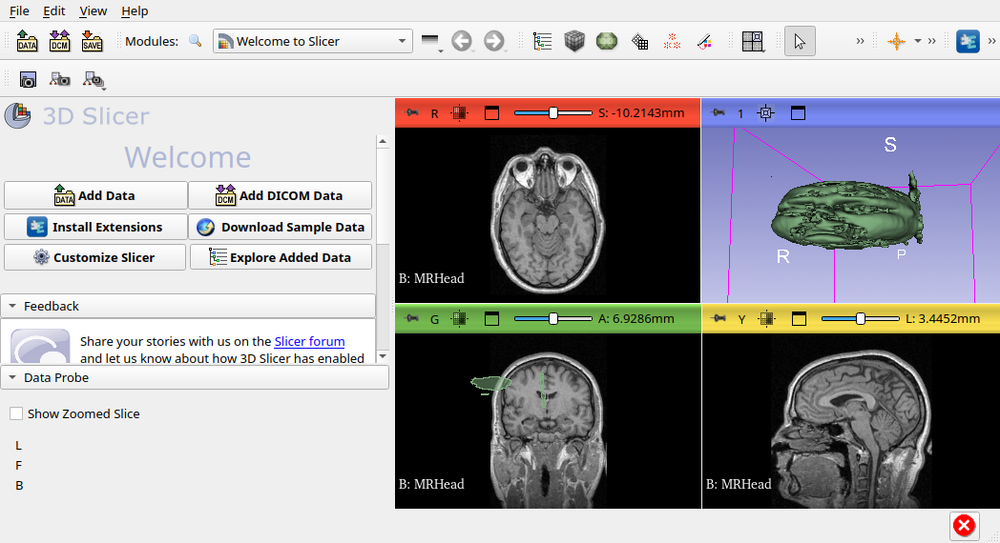
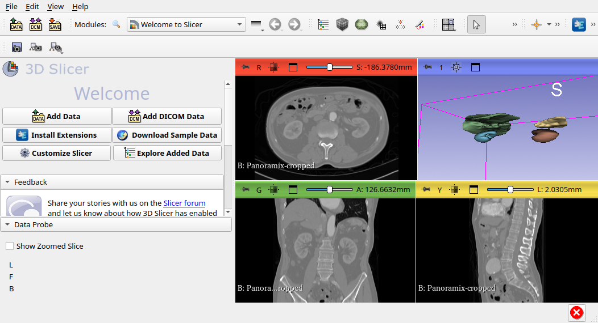

# SAT Segmentation Module

Universal medical image segmentation via text prompts, powered by [SAT (Segment Anything in 3D)](https://github.com/zhaoziheng/SAT), integrated into 3D Slicer as a scripted module.

## Architecture

```
3D Slicer (SATSeg module)          localhost:1527          SAT Inference Server
─────────────────────────    ──────────────────────►    ──────────────────────
 Select volume                POST /segment               Decode NIfTI
 Enter text labels             {volume_nifti: <b64>,      Run SAT-Nano (~7–30s)
 Click Run                      labels: [...],            Return combined mask
                                modality: "mr"}
 ◄──────────────────────    ◄──────────────────────
 Import as segmentation node   {mask_nifti: <b64>}
 Name segments from labels
 Show in slice views + 3D
```

## Requirements

| Component | Version |
|-----------|---------|
| 3D Slicer | 5.10.0 |
| Python (server env) | 3.10 |
| PyTorch | 2.10+cu128 (RTX 5090 / sm_120) |
| GPU | Any CUDA GPU (tested: RTX 5090) |

## Setup (one-time)

The Python environment and checkpoints are already configured under `modules/Segmentation/`:

```
sat-env/            ← Python 3.10 venv (torch, MONAI, transformers)
SAT/                ← SAT repo (patched for single-GPU)
checkpoints/
  SAT-Nano/Nano/
    nano.pth                  ← vision backbone (~1.4 GB)
    nano_text_encoder.pth     ← text encoder (~423 MB)
  BioLORD-2023-C/             ← text tower base model
```

If starting from scratch, follow Phase 2 in `agent/plan.md`.

## Usage

### 1. Start the inference server

Open a terminal and run:

```bash
cd /path/to/Agentic3DSlicer/modules/Segmentation
bash server/start_server.sh
```

You will see:
```
[INFO] Starting SAT inference server...
 * Running on http://127.0.0.1:1527
```

Leave this terminal open. The server is stateless — restart it any time.

### 2. Open 3D Slicer

```bash
cd /path/to/Agentic3DSlicer
./Slicer-5.10.0-linux-amd64/Slicer
```

### 3. Load a volume

- Drag-and-drop a NIfTI or DICOM file onto Slicer, **or**
- Use **Modules → Welcome → Download Sample Data** → select MRHead or CTChest

### 4. Open the SAT Segmentation module

Module selector (top bar) → **Segmentation** → **SAT Segmentation**

### 5. Connect

Click **Test Connection**. The status turns green when the server is reachable.
The server URL is saved automatically for future sessions.

### 6. Configure and run

| Field | What to enter |
|-------|--------------|
| Volume | Select your loaded volume from the dropdown |
| Labels | Comma-separated anatomy names (see examples below) |
| Modality | MR / CT / PET |

Click **Run SAT Segmentation**. Progress is shown in the status bar.

### 7. View results

- Slice views update automatically with coloured segments
- Click **Show 3D** to build the surface mesh and switch to the 3D view

## Label examples

**MR brain**
```
brain stem, cerebellum, left hippocampus, right hippocampus, thalamus
```

**CT abdomen**
```
liver, spleen, pancreas, gallbladder, left kidney, right kidney, aorta
```

**CT thorax**
```
left lung, right lung, heart, aorta, trachea
```

Use natural anatomy names (same terminology as medical literature). If a segment is empty, try rephrasing (e.g. `kidney` → `left kidney`).

## Server API reference

```
GET  /health     → {"status": "ok", "model": "SAT-Nano"}

POST /segment    Body (JSON):
  {
    "volume_nifti": "<base64 .nii.gz>",
    "labels":       ["liver", "spleen"],
    "modality":     "ct" | "mr" | "pet",
    "dataset":      "custom"          (optional)
  }
  Response:
  {
    "status":     "ok",
    "mask_nifti": "<base64 .nii.gz>"  ← integer labelmap, index = label order
  }
```

## File structure

```
modules/Segmentation/
├── SATSeg/                    ← Slicer scripted module
│   ├── SATSeg.py              ← Module + Widget + Logic
│   ├── CMakeLists.txt
│   ├── Resources/Icons/SATSeg.png
│   └── Testing/SATSegTest.py
├── server/
│   ├── sat_server.py          ← Flask HTTP server (port 1527)
│   └── start_server.sh        ← Launcher script
├── SAT/                       ← SAT repo (patched)
│   └── run_inference_single_gpu.py   ← Single-GPU wrapper (5 monkey-patches)
├── sat_inference.py           ← Python API callable by the server
├── sat-env/                   ← Isolated Python environment
├── checkpoints/               ← Model weights
└── agent/                     ← Development notes + screenshots
    ├── plan.md
    ├── goal.md
    └── evaluation_screenshot.png
```

## Troubleshooting

| Error | Cause | Fix |
|-------|-------|-----|
| "Test Connection" stays red | Server not running | Run `start_server.sh` first |
| Segment is empty (all zeros) | Label name not recognised | Try a different phrasing |
| `KeyError: None` in server log | Missing `--text_encoder ours` | Already fixed in `sat_inference.py` |
| `SameFileError` in server log | JSONL path conflict | Already fixed in `sat_inference.py` |
| `CUDA error: no kernel image` | Wrong PyTorch build for GPU | Re-install `torch+cu128` in sat-env |
| `ptp()` AttributeError | NumPy ≥ 2.0 with MONAI 1.1.0 | `uv pip install "numpy<2.0"` in sat-env |

See `agent/sat-python-env-setup.md` for full environment setup details.

## Automated evaluation

Evaluated 2026-03-06 on RTX 5090 (sm_120 Blackwell), Slicer 5.10.0.

### MR — brain (MRHead)

**Script:** `agent/eval_mr_brain.py`
**Labels:** `brain`
**Result:** 1 segment, clean continuous mask, no errors



The 3D view (top-right) shows a solid, continuous brain surface. The coronal slice shows a clean green overlay covering the full cerebrum. This is the recommended label for brain MRI.

---

### CT — abdominal organs (CTAAbdomenPanoramix)

**Script:** `agent/eval_ct_abdomen.py`
**Labels:** `liver, spleen, left kidney, right kidney`
**Result:** 4 segments, distinct coloured structures, no errors



The 3D view shows four well-separated organ meshes (liver, spleen, both kidneys) in distinct colours. CT abdominal organs have sharp intensity boundaries and are among SAT-Nano's strongest use cases.

---

> **Note on segmentation quality:** Results are proportional to structure size and boundary clarity.
> Large organs on CT (liver, kidneys) segment cleanly. Small or complex structures on MR
> (brain stem, cerebellum) produce noisier masks. When in doubt, start with large, well-defined
> organs before fine-grained anatomy.
